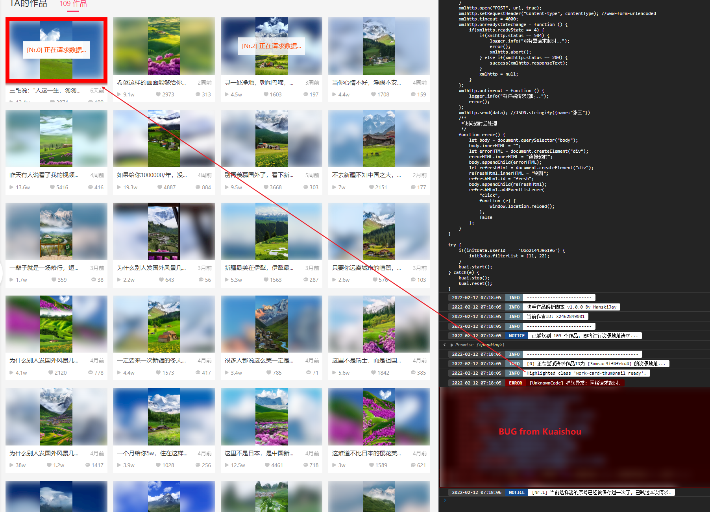
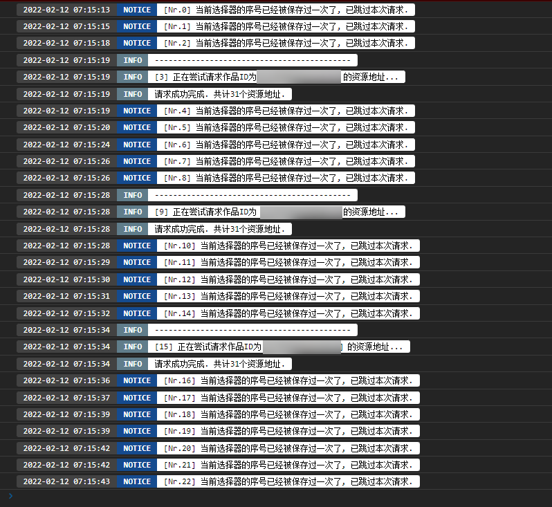
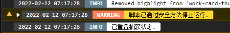

# KuaishouParser
快手短视频批量下载脚本

此项目采用 `OwOFrame` 进行的后端构建, 需要配套使用. 项目地址: [点我](https://github.com/Tommy131/OwOFrame) 
前端的Log输出采用 `OwOTools`, 已集成在JavaScript脚本中. 项目地址: [点我](https://github.com/Tommy131/OwOTools)

## 实现目标

- [x] 支持解析单个作者的全部作品
- [x] ~~支持解析分享的视频链接(尽管作品被作者设为不允许下载)~~ (已失效)
- [ ] 后台显示最近的解析记录
- [ ] 定时解析指定作者的作品
- [ ] 记录解析作品的详情（标题，发布时间，赞数等）
- [ ] 敬请期待......给个Star鼓励我开发吧！！！拜托了！！！

## 怎么使用?
1. 先克隆项目[OwOFrame](https://github.com/Tommy131/OwOFrame)到一个文件目录下.
2. 安装好后端框架 `OwOFrame` 之后, 将此项目克隆到 `application` 项目内.
3. 重命名 `KuaishouParser` 为 `kuai`.
4. 打开快手官网并登录你的账号.
5. 搜索你想保存的作者名称, 点击加载完成页面后打开浏览器控制台 (F12).
6. 注入 `Javascript` 代码 ([点我](/static/js/KuaishouParser.js))
7. 等待运行结束, 最终抓取到的地址将会通过 `POST` 请求提交到本App进行保存.
8. 在 `CMD` 或 `任意终端` 中输入指令 `php owo kuai file [作者ID]` 进行资源地址批量下载.
9. 若资源解析成功, 在 `Windows系统` 中将会自动打开保存的文件目录.

## 特性
- [x] 支持保存客户端中无法下载的视频/照片
- [x] 下载的照片目前皆无水印 (也许后期官方会修复这个BUG)
- [x] 下载的视频目前为原始上传视频 (也就是说没有后面的 `快手, 记录美好生活`)
- [x] Javascript脚本支持解析缓存
- [x] Javascript脚本支持随时终止运行, 通过命令 `kuai.stop()` 实现.

### 截图展示

自动追踪当前目标 

自动缓存已解析过的目标 

可停止的脚本执行 

 

## Statement
&copy; 2016-2022 [`OwOBlog-DGMT`](https://www.owoblog.com). Please comply with the open source license of this project for modification, derivative or commercial use of this project.

> My Contacts:
- Website: [`HanskiJay`](https://www.owoblog.com)
- Telegram: [`HanskiJay`](https://t.me/HanskiJay)
- E-Mail: [`HanskiJay`](mailto:support@owoblog.com)
