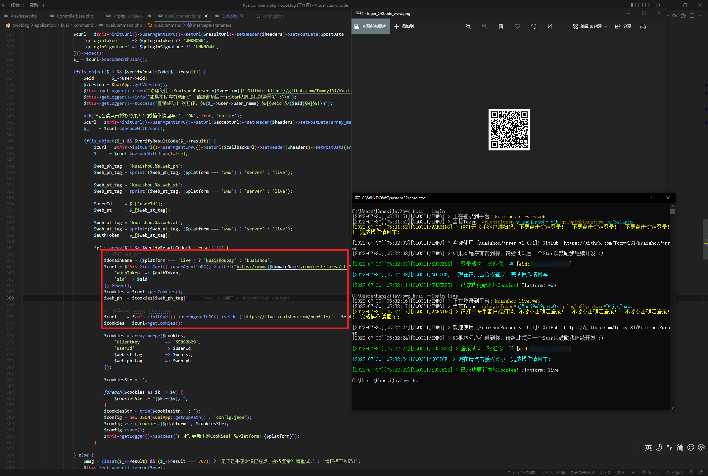

# KuaishouParser

开源许可证:  [Learn More](https://opensource.org/licenses/Apache-2.0)  
快手短视频批量下载脚本

此项目采用 `OwOFrame` 进行的后端构建, 需要配套使用. 项目地址: [点我](https://github.com/Tommy131/OwOFrame)  
本项目仅用于学习交流等途径, 严禁贩卖此源码!  
请务必采用默认提供的Issue模板提交BUG或建议!  

[English version click here!](README_EN.md)

## 实现目标

- [x] 支持模拟扫码登录主动获取 `Cookies` (详见下方的使用方法)
- [x] 支持解析单个作者的全部作品
- [x] 支持解析 `手机客户端` 分享的视频链接
- [x] 支持解析 `PC网页端` 分享的视频链接
- [x] 支持下载尽管作品被作者设为不允许下载的作品
- [x] 支持解析单个作品的信息
- [x] 后台日志记录最近的解析记录
- [x] 后台日志记录解析作品的详情 (标题, 发布时间, 赞数等)
- [ ] 错误列表 (即请求超时等作品进入错误列表, 等待下次重试)
- [ ] 敬请期待......给个Star鼓励我开发吧!!! 拜托了!!! 这个项目真的花了我好多时间抓接口和优化!!!

## 怎么使用?

请根据以下步骤慢慢操作.

### 0. 安装说明

- 先克隆项目[OwOFrame](https://github.com/Tommy131/OwOFrame)到一个文件目录下.
- 安装好框架 `OwOFrame` 之后, 将此项目克隆到 `storage/module` 目录内.

> 注意: 你也可以直接使用指令 `git clone https://github.com/Tommy131/KuaishouParser.git` 到 `storage/module` 目录下.

### 1. Cookies的获取方法

- 打开快手官网 `www.kuaishou.com` 与 `live.kuaishou.com` 并登录你的账号.
- 搜索你想保存的作者名称, 点击加载完成页面后打开浏览器控制台 (F12).
- 分别在第一点中提到的两个站点中打开控制台并其中输入 `document.cookie` 之后, 复制其长串Cookies, 并将其粘贴到 `config.json` 中.

> 提示: 当然你也可以使用下方的模拟登录指令获取Cookies.

### 3. 配置文件解释

- config.json 中的 `www` 对应 `www.kuaishou.com`, `live` 对应 `live.kuaishou.com`.
- 默认的配置文件如下:

``` json
{
    "cookies": {
        "live": "(cookie: string)", // 这里填入 live.kuaishou.com 的 Cookies
        "www": "(cookie: string)"   // 这里填入 www.kuaishou.com 的 Cookies
    },
    "proxy": {
        "status": false,           // 是否使用代理服务器选项
        "address": "127.0.0.1",    // 代理服务器的地址
        "port": 10809              // 代理服务器的端口
    }
}
```

### 4. 指令部分

本项目的中心指令为 `owo kuai [arguments: string]`, 缺省 `php` 的前提是命令终端在当前项目的根目录中运行.  
全局的自动下载参数: `--autoDownload` 或 `--ad` (参数位置任意)

#### 4.1. 作者作品全解析

指令为:  `owo kuai [authorId: string]`  

- `authorId`: 作者ID (此处的ID可以为快手App中显示的快手号, 也可以为 <https://(快手的域名)/profile/authorId> 中的 authorId)

#### 4.2. 模糊用户搜索

指令为:  `owo kuai -search [userName: string]`  

- `authorId`: 用户名称

#### 4.3. 分享解析

指令为: `owo kuai -sid [id: string] (--mode-mobile)`

- 此处的 `id` 为 <https://v.kuaishou.com/xxxxxx> 中的 xxxxxx
- PC端为 <https://www.kuaishou.com/f/xxxxxx> 中的 xxxxxx
- `-sid`: 分享ID, 也可以写作 "-shareId"
- `--mode-pc`: 从Web网页端中解析
- `--mode-mobile`: 从手机客户端中解析 (默认解析平台为手机客户端)

#### 4.4. 缓存删除

指令为: `owo kuai -d [fileName: string] [...string]`

- 此处的 `fileName` 为 `downloaded` 目录下的任意文件/文件夹名称

#### 4.5. 模拟登录 (扫码登录)

指令为: `owo kuai login (platform: string)`

- 此处的 `platform` 为登录的站点/平台 (默认 `live`, 另外的选项为 `www`)
- 根据提示进行操作! 如下图:


#### 4.6. 打开文件目录 (仅 Windows)

指令为: `owo kuai -o (name: string)`

- 默认输入指令且不带参数时, 将打开资源下载存储路径, 否则寻找参数 `name` 相关的文件/文件夹名称

## 特性

- [x] 支持模拟扫码登录主动获取Cookies
- [x] 支持分享解析视频下载
- [x] 支持保存客户端中无法下载的视频/照片
- [x] 下载的照片目前皆无水印
- [x] 下载的视频目前为原始上传视频 (也就是说没有后面的 "快手, 记录美好生活")
- [x] 日志记录
- [x] 跨平台兼容
- [x] 支持使用代理服务

## 截图展示 (后端指令实现)

CLI数据抓取  


## Statement

&copy; 2016-2022 [`OwOBlog-DGMT`](https://www.owoblog.com). Please comply with the open source license of this project for modification, derivative or commercial use of this project.

> My Contacts:

- Website: [`HanskiJay`](https://www.owoblog.com)
- Telegram: [`HanskiJay`](https://t.me/HanskiJay)
- E-Mail: [`HanskiJay`](mailto:support@owoblog.com)
