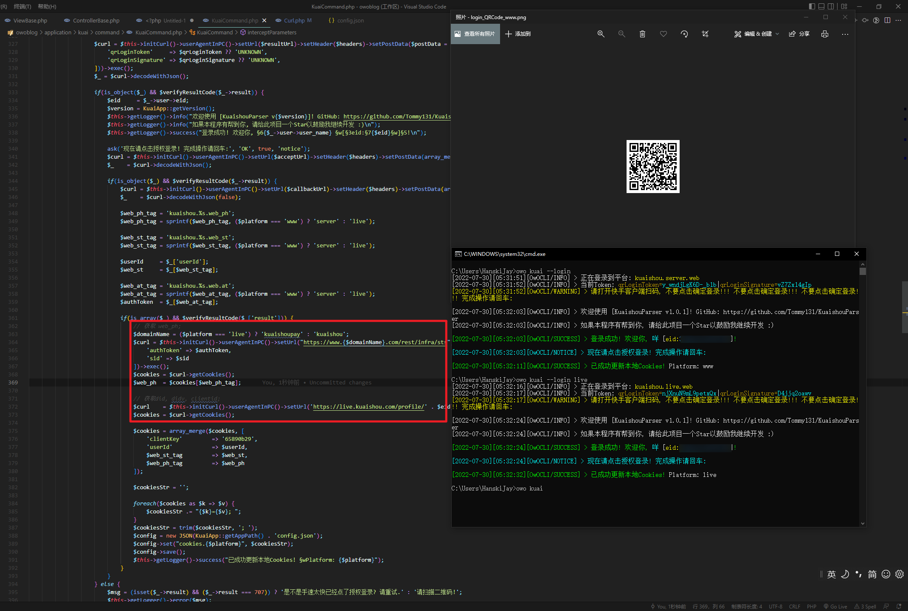
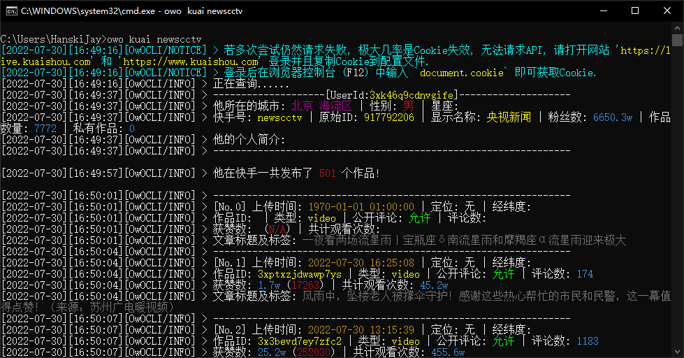

# KuaishouParser

Open Source License:  [Learn More](https://opensource.org/licenses/Apache-2.0)  
Kuaishou short video batch download script

This project uses `OwOFrame` for backend construction, which needs to be used together. Website: [Click me](https://github.com/Tommy131/OwOFrame)  
This project is only used for learning and communication, and it is strictly prohibited to sell this source code!  
Be sure to submit bugs or suggestions using the default Issue template provided!  

## Goals

- [x] Support for simulating QR code login to actively obtain `Cookies` (see the usage below for details)
- [x] support parsing all works of a single author
- [x] Support parsing video links shared by `mobile client`
- [x] Support parsing video links shared by `PC web page`
- [x] Downloads are supported even though the work is set by the author to not allow downloads
- [x] Support for parsing information of a single work
- [x] Background logging to record recent parsing records
- [x] Background log records and analyzes the details of the work (title, release time, likes, etc.)
- [ ] Error list (i.e. request timeout and other works enter the error list, waiting for the next retry)
- [ ] Stay tuned... Give more Stars to encourage me to develop!!! Please!!! This project really took me a lot of time to grasp the interface and optimize!!!

## How to use?

Please follow the steps below slowly.

### 0. Installation

- First clone the project [OwOFrame](https://github.com/Tommy131/OwOFrame) to a file directory.
- After installing the framework `OwOFrame`, clone this project into the `storage/module` directory.

> Attention: You can also use the command `git clone https://github.com/Tommy131/KuaishouParser.git` directly to the `storage/module` directory.

### 1. How to get cookies?

- Open website of Kuaishou `www.kuaishou.com` and `live.kuaishou.com` and log in your account.
- Search for the name of the author you want to save, click to load the page and open the browser console (F12).
- After opening the console and entering `document.cookie` in each of the two sites mentioned in the first point, copy the long string of Cookies and paste it into `config.json`.

> Notice: Of course, you can also use the simulated login command below to obtain Cookies.

### 3. Configuration file explanation

- `www` in config.json corresponds to `www.kuaishou.com`, `live` corresponds to `live.kuaishou.com`.
- The default configuration file is like as follows:

``` json
{
    "cookies": {
        "live": "(cookie: string)", // Fill in the cookies of live.kuaishou.com here
        "www": "(cookie: string)"   // Fill in the cookies of www.kuaishou.com here
    },
    "proxy": {
        "status": false,            // whether to use proxy server option
        "address": "127.0.0.1",     // the address of the proxy server
        "port": 10809              // port of the proxy server
    }
}
```

### 4. Explanation for Commands

The main command of this project is `owo kuai [arguments: string]`, the premise of default `php` is to run the command terminal in the root directory of the current project.  
Global auto-download parameter: `--autoDownload` or `--ad` (any position for this parameter)

#### 4.1. Full analysis of author's works

The command is: `owo kuai [authorId: string]`  

- `authorId`: Author ID (the ID here can be the Kuaishou account displayed in the Kuaishou App, or the authorId in <https://(Kuishou>'s domain name)/profile/authorId)

#### 4.2. User Search

The command is: `owo kuai -search [userName: string]`  

- `userName`: The name you want to search

#### 4.3. Share Analysis

The command is: `owo kuai -s [id: string] (--mode-mobile)`

- here's `id` is xxxxxx in <https://v.kuaishou.com/xxxxxx>
- on PC's `id` is xxxxxx in <https://www.kuaishou.com/f/xxxxxx>
- `-sid`: share Id, another way is "-shareId"
- `--mode-pc`: Parse from web page
- `--mode-mobile`: Parse from KuaiShou Mobile Client (default parsing platform is mobile client)

#### 4.4. Delete Cache

Th command is: `owo kuai -d [fileName: string] [...string]`

- `fileName`: the name in path `downloaded` (could be a dir or a file)

#### 4.5. Simulate login (QR-Code)

The command is: `owo kuai -login (platform: string)`

- here's `platform` is the logged in site/platform (default `www`, other options are `live`)
- Follow the prompts! As shown below:


## Features

- [x] Support simulating QR-Code scanning login to actively obtain cookies
- [x] Support sharing analysis video download
- [x] Support saving videos/photos that cannot be downloaded in the client
- [x] The downloaded photos currently have no watermark
- [x] The downloaded video is currently the original uploaded video (that is to say, there is no "快手, 记录美好生活" behind)
- [x] logging
- [x] Cross-platform compatible
- [x] support using proxy service

## Screenshot display (backend command implementation)

CLI data capture  


## Statement

&copy; 2016-2022 [`OwOBlog-DGMT`](https://www.owoblog.com). Please comply with the open source license of this project for modification, derivative or commercial use of this project.

> My Contacts:

- Website: [`HanskiJay`](https://www.owoblog.com)
- Telegram: [`HanskiJay`](https://t.me/HanskiJay)
- E-Mail: [`HanskiJay`](mailto:support@owoblog.com)
